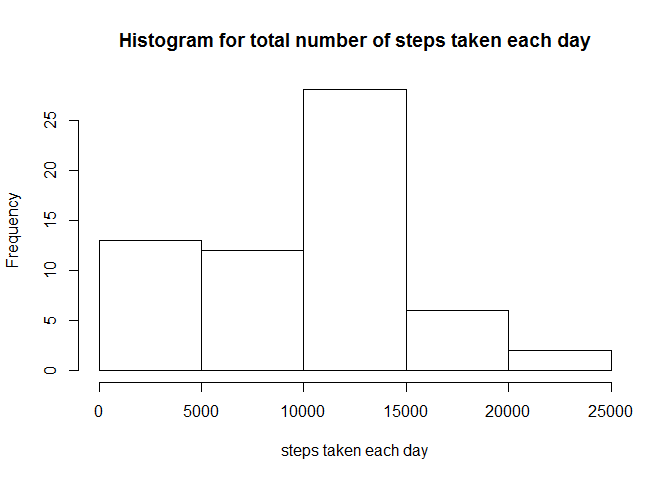
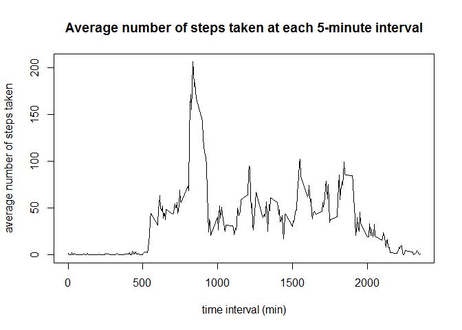
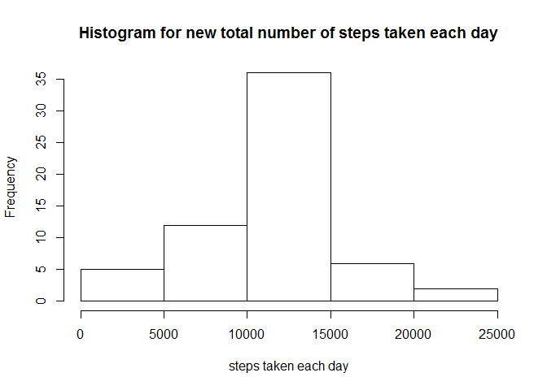
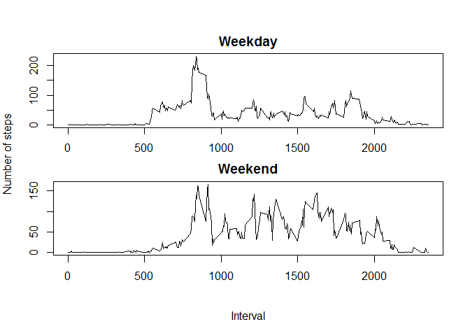

# Reproducible Research: Peer Assessment 1

This is a RMarkdown file written to fulfill the course requirement for Reproducible Research.

## Loading and preprocessing the data

Unzip the file and read the "activity.csv"" file.

```r
unzip(zipfile="./activity.zip")
activity <- read.csv("activity.csv", header=TRUE)
```

Look at the structure of the data.

```r
str(activity)
```

```
## 'data.frame':	17568 obs. of  3 variables:
##  $ steps   : int  NA NA NA NA NA NA NA NA NA NA ...
##  $ date    : Factor w/ 61 levels "2012-10-01","2012-10-02",..: 1 1 1 1 1 1 1 1 1 1 ...
##  $ interval: int  0 5 10 15 20 25 30 35 40 45 ...
```

There are three variables (steps, date, interval). Date is a factor with 61 levels.

Look at the summary of the data.

```r
summary(activity)
```

```
##      steps                date          interval     
##  Min.   :  0.00   2012-10-01:  288   Min.   :   0.0  
##  1st Qu.:  0.00   2012-10-02:  288   1st Qu.: 588.8  
##  Median :  0.00   2012-10-03:  288   Median :1177.5  
##  Mean   : 37.38   2012-10-04:  288   Mean   :1177.5  
##  3rd Qu.: 12.00   2012-10-05:  288   3rd Qu.:1766.2  
##  Max.   :806.00   2012-10-06:  288   Max.   :2355.0  
##  NA's   :2304     (Other)   :15840
```

In each level of date, there are 288 objects. Hence, making up 17568 objects in total.

## What is mean total number of steps taken per day?

- Calculate the total number of steps taken per day.

Load the "dplyr"" package. Install package if it is not available.

```r
if(!require(dplyr)){
    install.packages("dplyr")
    library(dplyr)}
```

```
## Warning: package 'dplyr' was built under R version 3.2.1
```

Group the data by date using the group_by () function.

```r
by_date <- group_by(activity, date)
```

Calculate the total number of steps per day.

```r
total_steps <- summarise(by_date, sum=sum(steps, na.rm=TRUE))
head(total_steps)
```

```
## Source: local data frame [6 x 2]
## 
##         date   sum
## 1 2012-10-01     0
## 2 2012-10-02   126
## 3 2012-10-03 11352
## 4 2012-10-04 12116
## 5 2012-10-05 13294
## 6 2012-10-06 15420
```

- Make a histogram for the total number of steps taken each day.

```r
hist.data <- total_steps$sum
hist(hist.data, main="Histogram for total number of steps taken each day",
     xlab="steps taken each day")
```

 

- Calculate and report the mean and median of the of the total number of steps taken per day.

Calculate the mean and median for steps taken per day.

```r
mean.median <- summarise(by_date, 
                         mean.steps=mean(steps, na.rm=TRUE), 
                         median.steps=median(steps, na.rm=TRUE))
head(mean.median)
```

```
## Source: local data frame [6 x 3]
## 
##         date mean.steps median.steps
## 1 2012-10-01        NaN           NA
## 2 2012-10-02    0.43750            0
## 3 2012-10-03   39.41667            0
## 4 2012-10-04   42.06944            0
## 5 2012-10-05   46.15972            0
## 6 2012-10-06   53.54167            0
```

## What is the average daily activity pattern?

- Make a time series plot (i.e. type="l") of the 5-minute interval (x-axis) and the average number of steps taken, averaged across all days (y-axis).

Group the data by interval using the group_by () function.

```r
by_interval <- group_by(activity, interval)
```

Calculate the average steps for each interval across day and plot.

```r
steps.average.across.day <- summarise(by_interval,
                                      mean=mean(steps, na.rm=TRUE))
plot(steps.average.across.day, type="l", 
     xlab="time interval (min)", ylab="average number of steps taken",
     main="Average number of steps taken at each 5-minute interval")
```

 

- Which 5-minute interval, on average across all the days in the dataset, contains the maximum number of steps?

Find the maximum number of steps.

```r
max.steps <- max(steps.average.across.day[,2])
max.steps
```

```
## [1] 206.1698
```
Find the 5-minute interval with the maximum number of steps.

```r
time.interval <- which(steps.average.across.day[,2]==max.steps)
time.interval
```

```
## [1] 104
```
Hence, the 104<sup>th</sup> 5-minute interval has the maximum number of steps.

## Imputing missing values

- Calculate and report the total number of missing values in the dataset (i.e. the total number of rows with NAs)

```r
sum(is.na(activity$steps))
```

```
## [1] 2304
```

- Devise a strategy for filling in all of the missing values in the dataset. The strategy does not need to be sophisticated. For example, you could use the mean/median for that day, or the mean for that 5-minute interval, etc.

Load the "zoo"" package. Install package if it is not available.

```r
if(!require(zoo)){
    install.packages("zoo")
    library(zoo)}
```

```
## Warning: package 'zoo' was built under R version 3.2.2
```
Since the mean and median still consist of NAs, the average number of steps across day for each interval will be used to replace the missing values.

```r
filled.steps <- as.data.frame(na.aggregate(activity$steps, by=activity$interval))
colnames(filled.steps) <- "filled.steps"
```

- Create a new dataset that is equal to the original dataset but with the missing data filled in.

```r
new.activity <- cbind(activity, filled.steps)
new.activity <- select(new.activity, filled.steps, date, interval)
head(new.activity)
```

```
##   filled.steps       date interval
## 1    1.7169811 2012-10-01        0
## 2    0.3396226 2012-10-01        5
## 3    0.1320755 2012-10-01       10
## 4    0.1509434 2012-10-01       15
## 5    0.0754717 2012-10-01       20
## 6    2.0943396 2012-10-01       25
```

- Make a histogram of the total number of steps taken each day. Calculate and report the **mean** and **median** total number of steps taken per day. Do these values differ from the estimates from the first part of the assignment? What is the impact of imputting missing data on the estimates of the total daily number of steps?

Plot histogram for the new total number of steps taken each day

```r
new_by_date <- group_by(new.activity, date)
new_total_steps <- summarise(new_by_date, new.sum=sum(filled.steps, na.rm=TRUE))
new.hist.data <- new_total_steps$new.sum
hist(new.hist.data, main="Histogram for new total number of steps taken each day",
     xlab="steps taken each day")
```

 

Calculate the new mean and median

```r
new.mean.median <- summarise(new_by_date,
                             new.mean.steps=mean(filled.steps, na.rm=TRUE),
                             new.median.steps=median(filled.steps, na.rm=TRUE))
head(new.mean.median)
```

```
## Source: local data frame [6 x 3]
## 
##         date new.mean.steps new.median.steps
## 1 2012-10-01       37.38260         34.11321
## 2 2012-10-02        0.43750          0.00000
## 3 2012-10-03       39.41667          0.00000
## 4 2012-10-04       42.06944          0.00000
## 5 2012-10-05       46.15972          0.00000
## 6 2012-10-06       53.54167          0.00000
```

Put the two data frames together for comparison

```r
compare.old.new <- cbind(mean.median, new.mean.median[,c(2,3)])
compare.old.new <- select(compare.old.new, date, 
                          mean.steps, new.mean.steps,
                          median.steps, new.median.steps)
head(compare.old.new)
```

```
##         date mean.steps new.mean.steps median.steps new.median.steps
## 1 2012-10-01        NaN       37.38260           NA         34.11321
## 2 2012-10-02    0.43750        0.43750            0          0.00000
## 3 2012-10-03   39.41667       39.41667            0          0.00000
## 4 2012-10-04   42.06944       42.06944            0          0.00000
## 5 2012-10-05   46.15972       46.15972            0          0.00000
## 6 2012-10-06   53.54167       53.54167            0          0.00000
```

The **mean** and **median** only differ for the first day, but are identical for the rest of the days.

```r
compare.total <- cbind(total_steps, new_total_steps[,2])
head(compare.total)
```

```
##         date   sum  new.sum
## 1 2012-10-01     0 10766.19
## 2 2012-10-02   126   126.00
## 3 2012-10-03 11352 11352.00
## 4 2012-10-04 12116 12116.00
## 5 2012-10-05 13294 13294.00
## 6 2012-10-06 15420 15420.00
```

Similar to **mean** and **median**, the newly added data has no effect on the daily total number of steps except for the first day.

## Are there differences in activity patterns between weekdays and weekends?

- Create a new factor variable in the dataset with two levels-"weekday" and "weekend" indicating whether a given date is weekday or weekend day.

First, create a new column with the day of the week for each date

```r
new.activity <- mutate(new.activity, day=weekdays(as.Date(new.activity$date)))
head(new.activity)
```

```
##   filled.steps       date interval    day
## 1    1.7169811 2012-10-01        0 Monday
## 2    0.3396226 2012-10-01        5 Monday
## 3    0.1320755 2012-10-01       10 Monday
## 4    0.1509434 2012-10-01       15 Monday
## 5    0.0754717 2012-10-01       20 Monday
## 6    2.0943396 2012-10-01       25 Monday
```

Second, create a two levels factor that converts the day into either weekday or weekend

```r
day.or.end <- c("Saturday", "Sunday")
new.activity$day <- factor(new.activity$day%in%day.or.end,
                           levels=c(FALSE, TRUE),
                           labels=c("weekday", "weekend"))
head(new.activity)
```

```
##   filled.steps       date interval     day
## 1    1.7169811 2012-10-01        0 weekday
## 2    0.3396226 2012-10-01        5 weekday
## 3    0.1320755 2012-10-01       10 weekday
## 4    0.1509434 2012-10-01       15 weekday
## 5    0.0754717 2012-10-01       20 weekday
## 6    2.0943396 2012-10-01       25 weekday
```

- Make a panel plot containing a time series plot (i.e. type="l") of the 5-minute interval (x-axis) and the average number of steps taken, averaged across all weekday days or weekend days (y-axis).

Group the data by day using the group_by () function

```r
by_day_interval <- group_by(new.activity, day, interval)
```

Calculate the average number of steps taken across all weekdays and weekends per 5-minute interval

```r
mean.steps.day.end <- summarise(by_day_interval,
                                mean.steps=mean(filled.steps))
head(mean.steps.day.end)
```

```
## Source: local data frame [6 x 3]
## Groups: day
## 
##       day interval mean.steps
## 1 weekday        0 2.25115304
## 2 weekday        5 0.44528302
## 3 weekday       10 0.17316562
## 4 weekday       15 0.19790356
## 5 weekday       20 0.09895178
## 6 weekday       25 1.59035639
```

Plot the time series plot

```r
mean.weekday <- filter(mean.steps.day.end, day=="weekday")
mean.weekend <- filter(mean.steps.day.end, day=="weekend")
par(mfrow=c(2,1), mar=c(2,0,2,0), oma=c(4,4,2,2))
with(mean.weekday, {
        plot(interval, mean.steps, type="l", main="Weekday", xlab="", ylab="")})
with(mean.weekend, {
        plot(interval, mean.steps, type="l", main="Weekend", xlab="", ylab="")})
mtext("Number of steps", side=2, line=3, outer=TRUE)
mtext("Interval", side=1, line=2, outer=TRUE)
```

 
